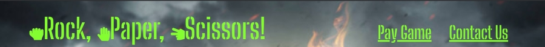
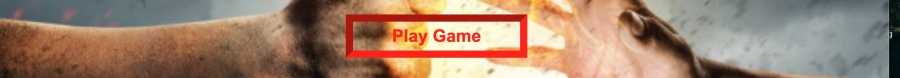
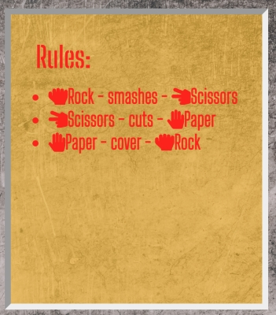
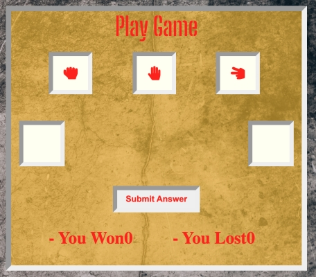
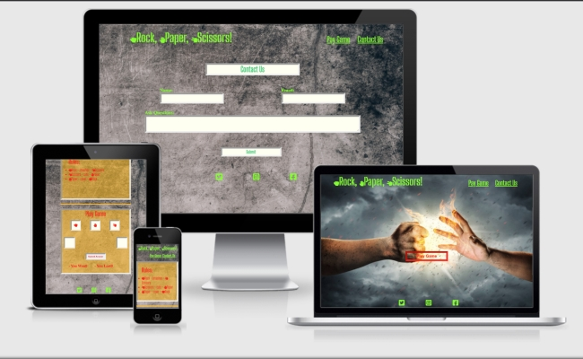

# Rock, Paper, Scissors!
## About
Rock, Paper, Scissors is a simple game that is played between two people. This game solely bases on chance.
The game was created to release a bit of stress all while having fun.
It is very easy to navigate around this website, find the rules, play the game and if any users have any comments they can contact us.

## Table of Contents
   - [User experiense](#user-experriense)
   - [Features](#features)
   - [Tehnologies Used](#tehnologies-used)
   - [Testing](#testing)
   - [Deployment](#deployment)
   - [Credit](#credit)

 ## User Experriense

#### As a user.
    . I want easily understand the layout of the site.
    . I want to be able to use the website on any device.
    . I want to easily navigate and to have fun achieving points.
    . I want to be able to leave comments. 

## Features

   ### Existing Features
   -__Navigation Bar__

  - This section will aloud us easy to navigate to all three pages includes links to the home page, play game page and contact us page.
The logo serves as a home page link so the user can find the way back if needed. 
Navigation links are changing the colour in red when hovered over, this lets the user know that is clickable.

   -__Play Game Button__

   

  - Play Game button is designed for the user to link to the Game page! 
When hovered over the background change the colour in orange it,s serve to lets the user know that it is clickable. Button's borders are stylet red colour to be easily spotted by the user if he/she wants to go straight to the game page. 

   -__Footer__

   

   -__Rules Section__
   
   

   -__Play Game Section__

   

   -__Contact Us Section__

   

## Tehnologies Used

 -__Balsmiq Wireframe__

### Fonts

### Colors

### Languages

  * HTML
  * CSS
  * JavaScript

## Testing

### Validator Testing

## Deployment

## Media

## Credit

  ### Content

