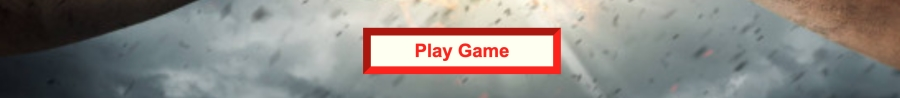

# Rock, Paper, Scissors!
## About
Rock, Paper, Scissors is a simple game that is played between two people. This game solely bases on chance.
The game was created to release a bit of stress all while having fun.
It is very easy to navigate around this website, find the rules, play the game and if any users have any comments they can contact us.

## Table of Contents
   - [User experiense](#user-experriense)
   - [Features](#features)
   - [Tehnologies Used](#tehnologies-used)
   - [Testing](#testing)
   - [Deployment](#deployment)
   - [Credit](#credit)

 ## User Experriense

#### As a user.
    . I want easily understand the layout of the site.
    . I want to be able to use the website on any device.
    . I want to easily navigate and to have fun achieving points.
    . I want to be able to leave comments. 
    . I want to be able easily to understand the game.

## Features

   ### Existing Features
   -__Navigation Bar__

  - This section will aloud us easy to navigate to all three pages includes links to the home page, play game page and contact us page.
The logo serves as a home page link so the user can find the way back if needed. 
Navigation links are changing the colour in red when hovered over, this lets the user know that is clickable.

   -__Play Game Button__

   

  - Play Game button is designed for the user to link to the Game page! 
When hovered over the background change the colour in orange it,s serve to lets the user know that it is clickable. Button's borders are styled red colour to be easily spotted by the user if he/she wants to go straight to the game page. 

   -__Footer__

   

   - Footer has been designed to be at the bottom of the page, it,s contains social media icons changing colour in red when hovered over and is an external social link that is opening in a new tab.

   -__Rules Section__
   
   

   - The rules section is designed to explain to users the Game rules and is styled with an orange background with red writing inside, this combination of colours helps to improve the contrast of the red writing.

   -__Play Game Section__

   

   - This section is designed where the users can play the game.
This section including user choice, computer choice and points achieved.
All clickable buttons styled with a red border when hovered over.
The "Submit Game" button is changing in "Play Again "after how the user starts the game to let the user know that this game still going and he can make his next choice.

   -__Contact Us Section__

   

   - Contact Us page is where the user can leave their comments.
All input boxes are styled with red borders when hovered over, it,s help the user to see what box he is selecting.

## Tehnologies Used

 -__Balsmiq Wireframe__

### Fonts

### Colors

### Languages

  * HTML
  * CSS
  * JavaScript

## Testing

### Validator Testing

 - HTML Home Page
   - No errors returned when passing through [W3C Validator](https://validator.w3.org/nu/?doc=https%3A%2F%2Fserjmartin.github.io%2FRock-Paper-Scissors%2Findex.html#textarea)

 - HTML Game Page
   - No errors returned when passing through [W3C Validator](https://validator.w3.org/nu/?doc=https%3A%2F%2Fserjmartin.github.io%2FRock-Paper-Scissors%2Fgame.html)

## Deployment

## Media

## Credit

  ### Content

